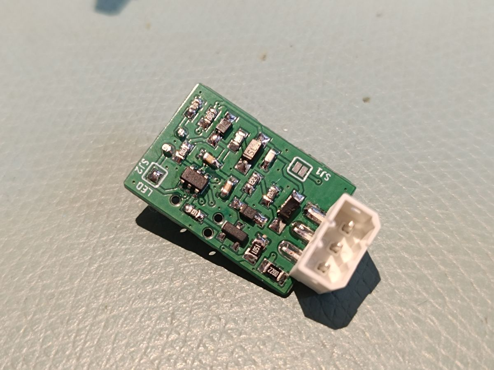
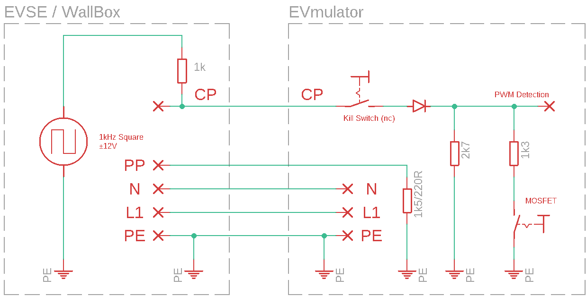
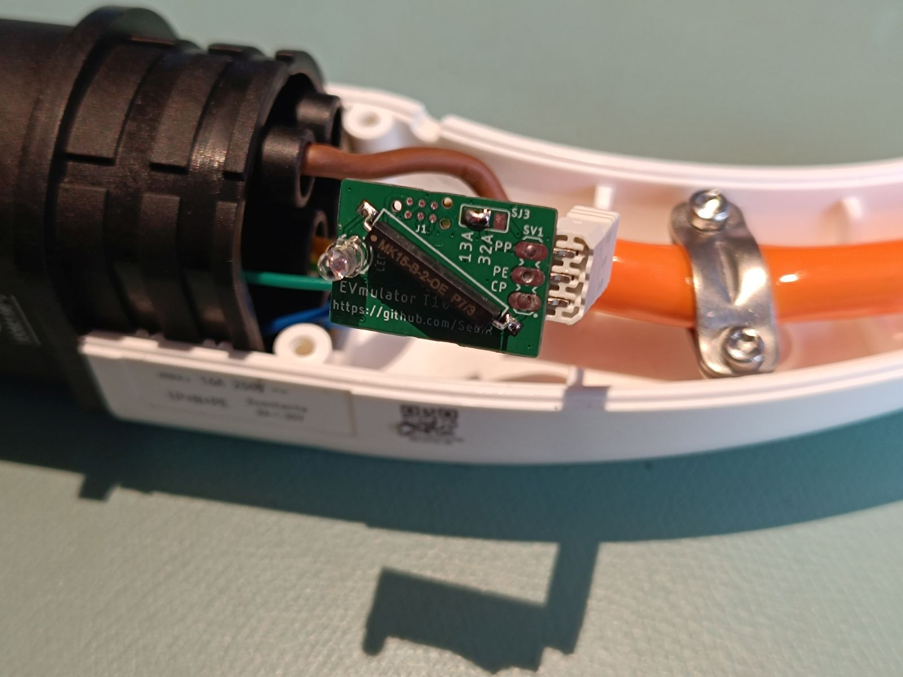
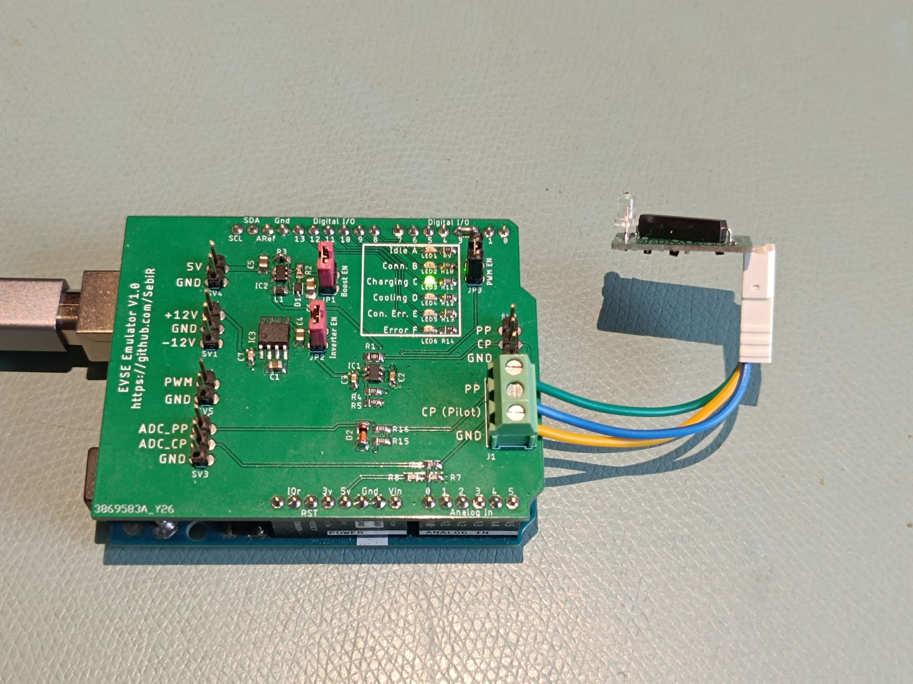

> [!CAUTION]
> This project includes dangerous voltages of 230V/400V, a bit of tinkering and (public) charging infrastructure.
> Build and use this project only if you know what you are doing. I am not liable for injuries or damages!

# EVmulator
A small PCB to go into IEC 62196 Typ 2 EV charging plugs to emulate a car to use a charging station as a normal outlet.

It's currently running with an ATTiny85, although an ATTiny25 will suffice. In the future it might be done with an ATTiny10.

## Features
* Two LEDs as status indicator
* Automatic switch from connected to charging
* 13 or 32A selectable current
* EVSE Pilot monitoring
* Completely powered by the pilot signal

## Function

The EVmulator simulates a connected car for the EVSE (electric vehicle supply equipment, the wallbox)

The EVSE outputs a 1kHz square wave signal with ±12V referenced to PE with 1000 ohms impedance on the CP (Control Pilot) pin and measures the voltage of the CP line.
As the EVmulator has a 1300 ohms resitor to PE, the positive voltage of the CP line is pulled to 9V and the EVSE detects a connected car.

After connecting, the EVmulator will detect the 1kHz PWM signal on the CP line and after approx. 5 seconds of PWM, the second restitor with 4.7kohms will be connected in parallel to the first resitor. As the voltage on the CP line drops to 6V, the EVSE will recognize the emulator as a charging car.

More information on Type 2 Signaling can be found here (in German):
https://www.goingelectric.de/wiki/Typ2-Signalisierung-und-Steckercodierung/

To end the charging process, a magnet is placed on the plug, opening a reed switch and signaling the end of charge to the charger.

## Usage

### Connection
Connect the three terminals of the EVmulator with the according pins of your IEC 62196 Type 2 male plug:

| Pin  | Function           | Description                                  |
|------|--------------------|----------------------------------------------|
| PP  | Control Pilot         | maximum current of the cable defined by a resistor |
| PE  | Earth | Commond ground for communication      |
| CP  | Control Pilot     | Communication line between car and charger |

### Solder Jumpers

There are two SMT solder jumpers located on the component side of the PCB: 
**SJ1** bypasses the internal reed switch in case you want to use a key switch or a push button to stop the charging process. Use NC (normally closed "openener" switches). 
**SJ2 LED** has to be closed after flashing the microcontroller to activate the status LED. The TPI programming interface is a bit finicky when it comes to other components on the programming lines. 

And there's one solder jumper on the side with the reed switch: 
**SJ3 13/32A** let's you select between a max. current of 13A or 32A depending on your application. Always make sure to use rated cables and connectors!

### In the field
Just connect you Type 2 plug to the wallbox or charging station and authorize the charging process as you would normally.
The EVmulator will signal the charger that a car has been connected and that it is charging. 

To stop the charging process, place a magnet over the reed switch and unplug the plug.

| LED Behavior        | State      |
|---------------------|---------------|
| Quick blink (1 ms flash every ~32 ms) | Idling, waiting for CP signal          |
| Slow blink (1 ms flash every ~125 ms) | Checking if the CP signal is valid       |
| Very slow blink (1 ms flash every ~1 s) | Charging        |

## Firmware

The firmware is written for the ATTiny10 microcontroller using the Arduino IDE and the <a href="https://github.com/technoblogy/attiny10core">attiny10core</a> board definitions.

### Hardware Configuration

| Pin  | Function           | Description                                  |
|------|--------------------|----------------------------------------------|
| PB0  | LED Output         | Blinks to indicate system state              |
| PB1  | CHARGE_ON (Output) | Controls a MOSFET for to signal Charging state      |
| PB2  | Frequency Input     | Connected to external ~1kHz square wave, also Timer0 clock source |

### System Clock and Power Settings

- The system clock is derived from the 128 kHz Watchdog oscillator.
- A clock prescaler divides this to 32 kHz system frequency.
- The ADC and analog comparator are disabled to save power.
- The microcontroller primarily stays in `SLEEP_MODE_IDLE`, waking periodically via the Watchdog Timer interrupt.

### State Machine

The firmware operates in three states:

1. **IDLE**  
   - Wakes every ~32 ms via WDT.
   - If no external clock signal is detected (TCNT0 == 0), stays in IDLE.
   - If a clock signal is consistently present for 10 cycles, transitions to MEASURE.

2. **MEASURE**  
   - Wakes every ~125 ms.
   - Measures frequency using Timer0 (externally clocked).
   - If the frequency is above 500 Hz for 10 cycles, transitions to CHARGE.
   - Remains in MEASURE as long as signal is present and below 500 Hz.

3. **CHARGE**  
   - Wakes approximately every second.
   - Enables the CHARGE_ON MOSFET (PB1 high).
   - If frequency drops below 500 Hz for 5 consecutive cycles, reverts to MEASURE.

### LED Signal Behavior

The LED (on PB0) provides visual feedback for debugging and operational awareness:

| LED Behavior        | State(s)      | Meaning                                   |
|---------------------|---------------|-------------------------------------------|
| Quick blink (1 ms flash every ~32 ms) | IDLE          | Signal inactive or low frequency detected |
| Slow blink (1 ms flash every ~125 ms) | MEASURE       | Signal detected, measuring frequency       |
| Very slow blink (1 ms flash every ~1 s) | CHARGE        | Charging enabled, monitoring signal        |

All blinking is implemented by flashing the LED for 1 ms during each WDT interrupt.

### Power Optimization

- All unnecessary peripherals (ADC, comparator) are disabled.
- WDT interval is adjusted dynamically based on state.
- Sleep modes and minimal active time are used to reduce power consumption.
- Timer0 uses an asynchronous external clock, allowing operation even in low-power modes.

## Other

During development, I also created the <a href="https://github.com/SebiR/EVSE_Emulator_Shield">EVSE Emulator Shield</a> to test the EVmulator

