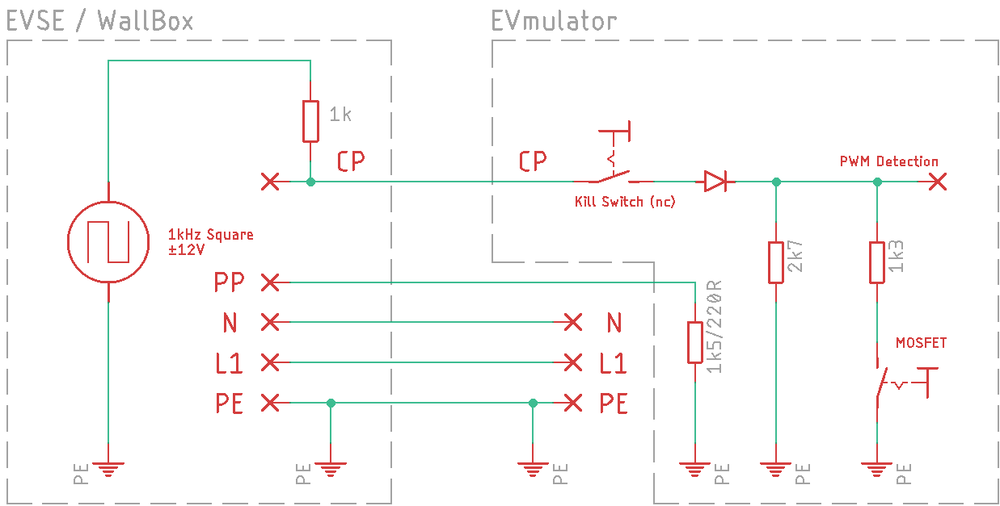

# EVmulator
A small PCB to go into IEC 62196 Typ 2 EV charging plugs to emulate a car to use a charging station as a normal outlet.

It's currently running with an ATTiny85, although an ATTiny25 will suffice. In the future it might be done with an ATTiny10.

## Features
* Two LEDs as status indicator
* Automatic switch from connected to charging
* 13 or 32A selectable current
* EVSE Pilot monitoring
* Completely powered by the pilot signal

## Function

The EVmulator simulates a connected car for the EVSE (electric vehicle supply equipment, the wallbox)

The EVSE outputs a 1kHz square wave signal with ±12V referenced to PE with 1000 ohms impedance on the CP (Control Pilot) pin and measures the voltage of the CP line.
As the EVmulator has a 1300 ohms resitor to PE, the positive voltage of the CP line is pulled to 9V and the EVSE detects a connected car.

After connecting, the EVmulator will detect the 1kHz PWM signal on the CP line and after approx. 5 seconds of PWM, the second restitor with 4.7kohms will be connected in parallel to the first resitor. As the voltage on the CP line drops to 6V, the EVSE will recognize the emulator as a charging car.

More information on Type 2 Signaling can be found here (in German):
https://www.goingelectric.de/wiki/Typ2-Signalisierung-und-Steckercodierung/
## Usage

## Firmware
The firmware is still under development and not really usable yet.